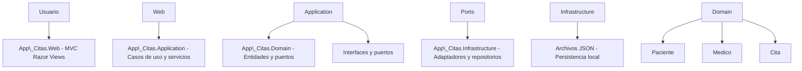

\# Diagrama de Arquitectura Hexagonal — App\_Citas

Este diagrama representa la separación entre la capa externa, la aplicación, el dominio y la infraestructura.

```mermaid

flowchart TD

 Usuario\["Usuario"] --> Web\["App\_Citas.Web - MVC Razor Views"]


   Web --> Application\["App\_Citas.Application - Casos de uso y servicios"]


 Application --> Domain\["App\_Citas.Domain - Entidades y puertos"]


 Application --> Ports\["Interfaces y puertos"]

Ports --> Infrastructure\["App\_Citas.Infrastructure - Adaptadores y repositorios"]


  Infrastructure --> JSON\["Archivos JSON - Persistencia local"]


  Domain --> Paciente\["Paciente"]

  Domain --> Medico\["Medico"]

  Domain --> Cita\["Cita"]

```

