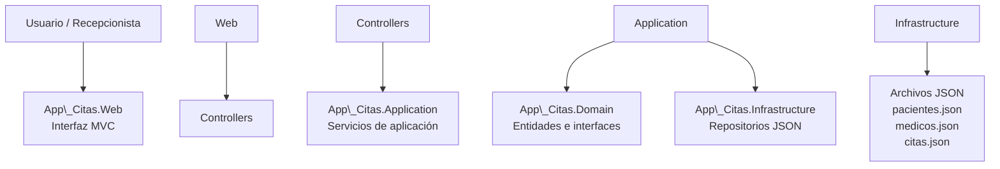

\# Diagrama de Contenedores — App\_Citas

Este diagrama muestra los principales contenedores o partes internas del sistema App\_Citas.

```mermaid

flowchart TD

Usuario\["Usuario / Recepcionista"] --> Web\["App\_Citas.Web<br/>Interfaz MVC"]


 Web --> Controllers\["Controllers"]

 Controllers --> Application\["App\_Citas.Application<br/>Servicios de aplicación"]


 Application --> Domain\["App\_Citas.Domain<br/>Entidades e interfaces"]

  Application --> Infrastructure\["App\_Citas.Infrastructure<br/>Repositorios JSON"]


  Infrastructure --> Data\["Archivos JSON<br/>pacientes.json<br/>medicos.json<br/>citas.json"]

```

